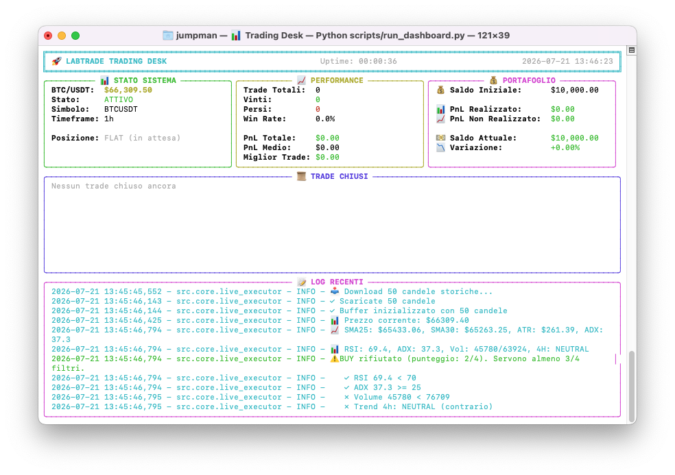
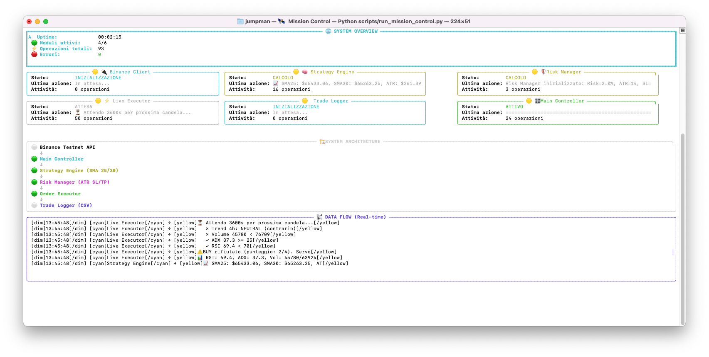

# 🚀 LabTrade - Algorithmic Trading System

**LabTrade** è un sistema di trading algoritmico modulare per i mercati crypto (Binance Futures).
Implementa una strategia di Trend Following con Triple Confirmation e Risk Management istituzionale.

## 🌟 Caratteristiche
- **Triple Confirmation**: SMA Crossover (25/30), ADX >= 25, Volume > 1.2x media, Multi-Timeframe (4h).
- **Risk Management**: Position sizing 2%, SL a 1.5x ATR, Ladder TP con R:R >= 2.0.
- **Dashboard**: UI terminale professionale con Rich (PnL, Drawdown, Expectancy).
- **Mission Control**: Monitoraggio moduli in tempo reale.

## 🏗️ Architettura
- src/core: Live Executor
- src/strategies: SMA + Triple Confirmation
- src/risk: Position sizing, ATR, SL/TP
- src/dashboard: Trading Desk, Mission Control

## ⚡ Quick Start
git clone https://github.com/iFabbro/LabTrade.git
cd LabTrade
python3 -m venv venv && source venv/bin/activate
pip install -r requirements.txt
python3 scripts/run_paper_trading.py --hours 24 --dry-run

## ️ Disclaimer
Software a scopo educativo. Testare sempre in Paper Trading.

## Interfaccia Utente

## 📊 Performance Storiche (Backtest 6 Mesi - BTCUSDT 1h)
| Metrica | Valore | Note |
| :--- | :--- | :--- |
| **Capitale Finale** | +1.11% | A partire da 10,000 USD |
| **Win Rate** | 51.7% | Con R:R medio ≥ 2.0 |
| **Max Drawdown** | **3.84%** | Risk management istituzionale attivo |
| **Trade Totali** | 116 | ~19 trade/mese (no overtrading) |

*Nota: I risultati sono ottenuti con leva massima 1x e rischio fisso del 2% per trade.*
